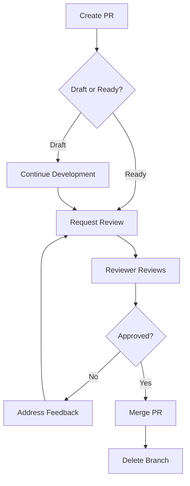

# Pull Request Guidelines for pulse-landing

## What to Do With Pull Requests

This guide explains how to handle pull requests in the pulse-landing repository.

### For Pull Request Reviewers

When you see a pull request, here's what you should do:

1. **Review the Changes**
   - Read the PR description to understand what changes were made
   - Review the code changes in the "Files changed" tab
   - Check that the changes align with the stated purpose
   - Ensure code quality and best practices are followed

2. **Test the Changes**
   - Pull the branch locally if needed: `git fetch origin && git checkout <branch-name>`
   - Run the development server: `pnpm dev`
   - Build the project: `pnpm build`
   - Run tests if applicable: `pnpm test`
   - Verify the changes work as expected

3. **Provide Feedback**
   - Leave comments on specific lines of code if you have concerns
   - Request changes if issues need to be fixed
   - Approve the PR if everything looks good
   - Use the "Review changes" button to submit your review

4. **Merge the Pull Request**
   - Once approved and all checks pass, merge the PR
   - Choose the appropriate merge strategy:
     - **Squash and merge** - for feature branches (recommended)
     - **Rebase and merge** - for keeping linear history
     - **Merge commit** - for preserving all commits
   - Delete the source branch after merging

### For Pull Request Authors

When creating a pull request:

1. **Write a Clear Description**
   - Explain what changes you made and why
   - Reference any related issues
   - Include screenshots for UI changes
   - List any breaking changes

2. **Keep PRs Focused**
   - One feature or fix per PR
   - Smaller PRs are easier to review
   - Split large changes into multiple PRs

3. **Ensure Quality**
   - All code is properly formatted
   - Tests pass locally
   - No linting errors
   - Build succeeds

4. **Respond to Feedback**
   - Address reviewer comments promptly
   - Push additional commits to fix issues
   - Re-request review when ready
   - Resolve conversations when addressed

## Managing Open Pull Requests

### Current Situation
This repository has **14 open draft PRs** created by GitHub Copilot for various tasks. Here's how to handle them:

#### Option 1: Review and Merge Ready PRs
For PRs that are complete and tested:
1. Mark the PR as "Ready for review" (remove draft status)
2. Review the changes
3. Merge if everything looks good
4. Delete the source branch

#### Option 2: Close Stale PRs
For PRs that are no longer needed:
1. Add a comment explaining why it's being closed
2. Close the PR without merging
3. Delete the source branch

#### Option 3: Continue Work on Draft PRs
For PRs that need more work:
1. Check out the branch
2. Make necessary changes
3. Push updates
4. Mark as ready for review when complete

### Recommended Actions for Each PR

**Dependabot PR (#1)**: Review and merge security updates
**Copilot PRs (#2-14)**: Review each one individually:
- Close PRs for features that aren't needed
- Merge PRs for completed features
- Continue work on PRs that are partially complete

## Pull Request Workflow

## Best Practices

1. **Keep PRs Small**: Easier to review and less likely to have conflicts
2. **Write Good Commit Messages**: Explain what and why, not just what
3. **Test Before Submitting**: Don't rely only on CI/CD
4. **Be Responsive**: Address feedback within 48 hours
5. **Clean Up**: Delete merged branches to keep repo tidy

## Questions?

If you're unsure about what to do with a specific PR, ask in the PR comments or reach out to @kfrye1212.
